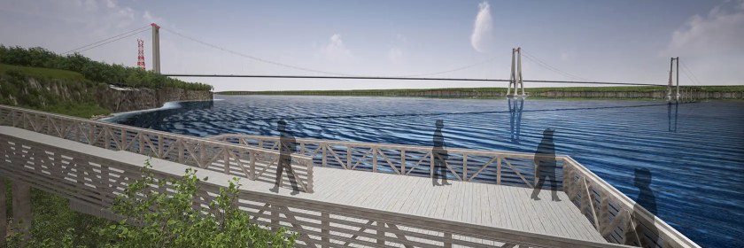
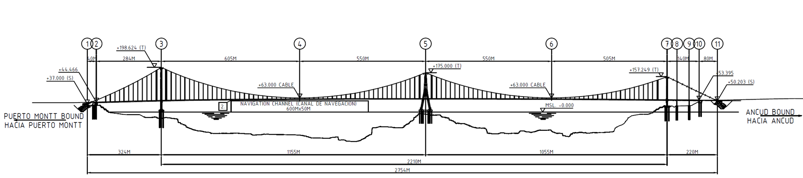
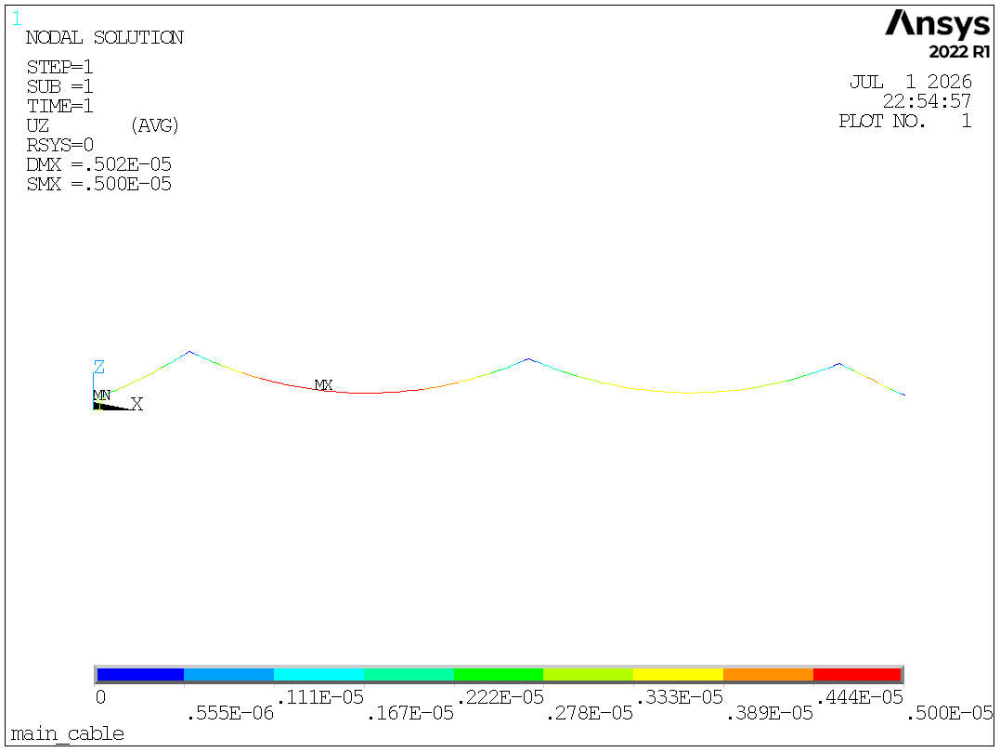
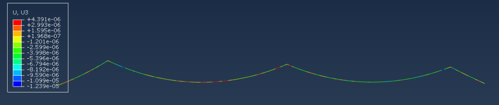

# Engineering Case 001 — Chacao Suspension Bridge

## 1. Project Overview

The Chacao Suspension Bridge is one of the most significant long-span bridge projects currently under construction in South America. Located across the Chacao Channel in southern Chile, the bridge connects Chiloé Island with the Chilean mainland.

The bridge adopts an asymmetric three-tower suspension bridge configuration with two unequal main spans, making it one of the world's most representative multi-span suspension bridges. Compared with conventional two-tower suspension bridges, its asymmetric structural system introduces greater challenges for cable shape finding, cable force equilibrium, and construction-stage analysis.

This engineering case demonstrates the application of **HCableAnalysis** to three-dimensional cable modeling, nonlinear shape-finding analysis, unstressed cable length determination, and finite element model generation for a complex long-span suspension bridge.

### Bridge Rendering

### Bridge Layout

---

## 2. Bridge Parameters

| Item | Value |
|------|------|
| Project | Chacao Suspension Bridge |
| Location | Chacao Channel, Chile |
| Bridge Type | Three-Tower Suspension Bridge |
| Total Length | Approximately 2,750 m |
| Main Spans | 1155 m + 1055 m |
| Structural Layout | Asymmetric Three-Tower Suspension Bridge |
| Deck | Four-Lane Highway |
| Sag Ratio | 1:9 |

---

## 3. Engineering Challenges

Compared with conventional suspension bridges, the Chacao Suspension Bridge presents greater numerical complexity due to its asymmetric multi-span structural configuration.

The major engineering challenges include:

- Three-dimensional cable modeling.
- Nonlinear cable shape-finding analysis.
- Unstressed cable length determination.
- Dead-load equilibrium of the multi-span cable system.
- Automatic generation of finite element geometry.

HCableAnalysis automatically performs nonlinear equilibrium iterations to obtain the equilibrium cable configuration and unstressed cable length, providing reliable initial geometry for subsequent finite element analysis.

---

## 4. Analysis Workflow

The complete analysis workflow consists of:

1. Cable parametric modeling.
2. Cable discretization.
3. Nonlinear cable shape-finding analysis.
4. Unstressed cable length calculation.
5. DXF geometry generation.
6. Finite element model export.
7. Numerical verification using ANSYS and Abaqus.

---

## 5. Numerical Verification

The generated cable geometry was independently verified using both **ANSYS** and **Abaqus**.

The comparison results demonstrate:

- Consistent cable geometry between different finite element platforms.
- Excellent agreement in displacement distributions.
- Numerical differences within **10⁻⁵**, validating the accuracy and robustness of the generated equilibrium cable configuration.

The results confirm that the cable model generated by HCableAnalysis can be directly used for subsequent structural analysis and construction-stage simulation.

---

## 6. Results

### DXF Geometry

The generated equilibrium cable geometry can be exported directly as a DXF file for CAD applications.

### ANSYS Verification

Finite element verification using ANSYS shows excellent agreement with the cable geometry generated by HCableAnalysis.

### Abaqus Verification

Independent verification using Abaqus further confirms the correctness of the generated cable configuration.

---

## 7. Software

This engineering case was completed using **HCableAnalysis**, including cable parametric modeling, nonlinear shape-finding analysis, unstressed cable length calculation, DXF geometry generation, finite element model export, and numerical verification using ANSYS and Abaqus.