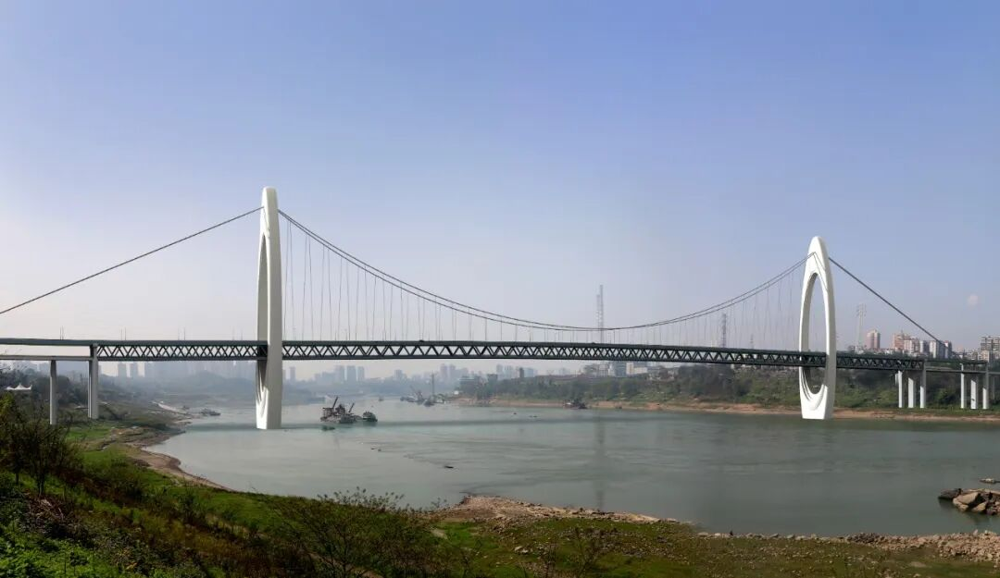
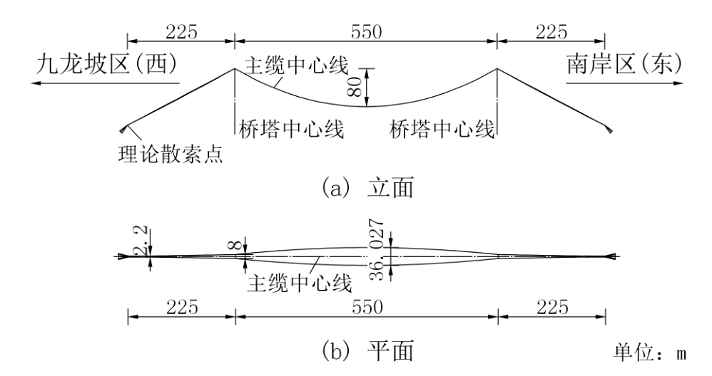
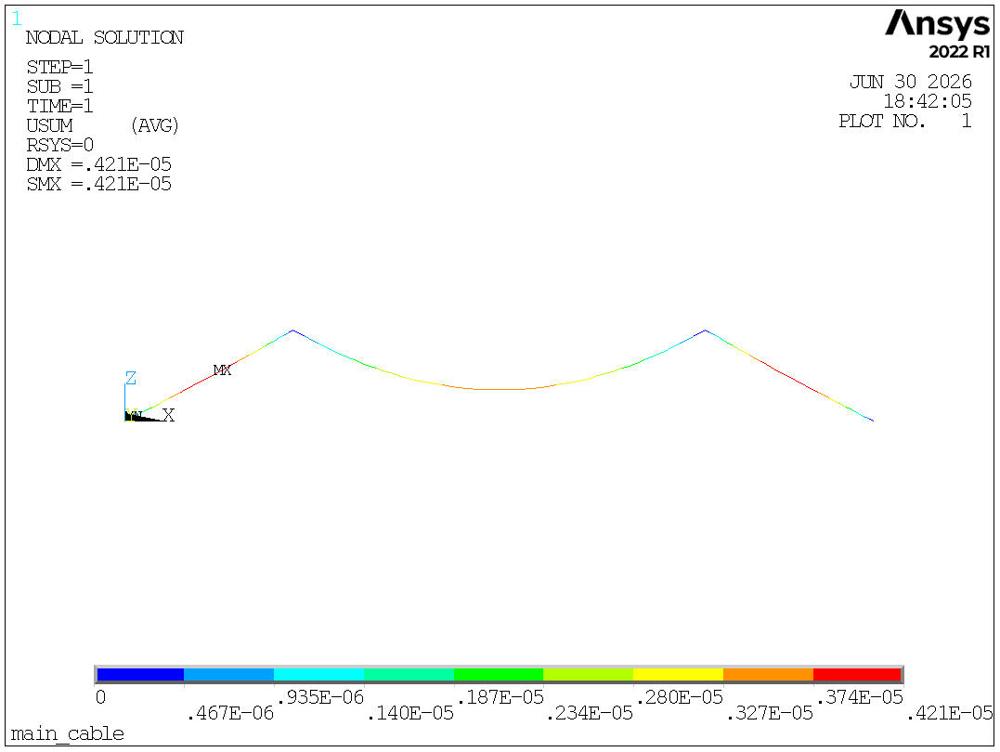
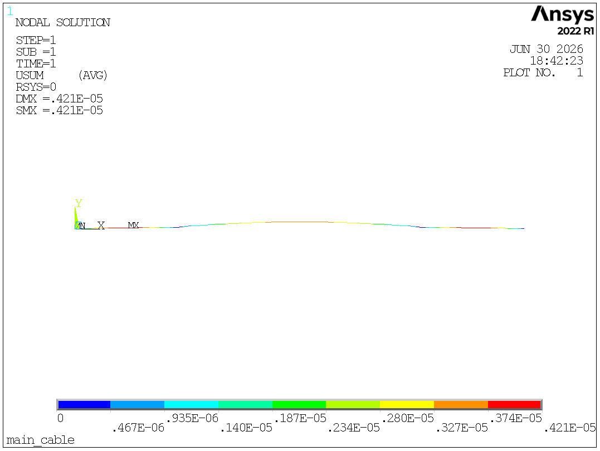
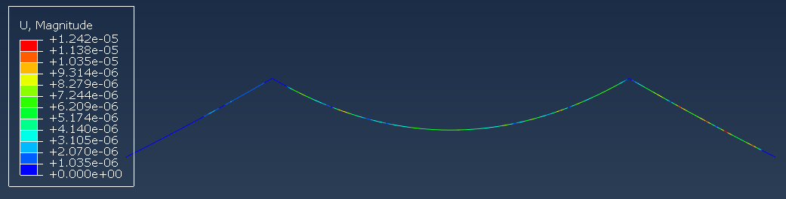
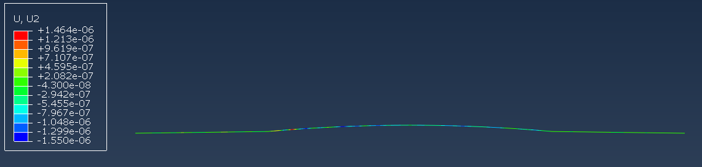

# Engineering Case 003 — Huangjiaoping Bridge

## 1. Project Overview

Huangjiaoping Bridge is a **ground-anchored spatial cable suspension bridge** carrying both highway traffic and urban rail transit. The bridge adopts a **double-deck steel truss girder** with a **550 m main span**, making it one of the world's largest double-deck spatial cable suspension bridges.

Compared with conventional suspension bridges, the spatial cable system introduces significantly higher geometric complexity and construction requirements, making cable shape-finding one of the key challenges during design and construction.

### Bridge Rendering

### Bridge Layout

---

## 2. Bridge Parameters

| Item | Value |
|------|------|
| Bridge Type | Ground-Anchored Spatial Cable Suspension Bridge |
| Main Bridge Length | 752 m |
| Main Span | 550 m |
| Structural Layout | Double Towers, Three Spans |
| Deck Width | 39.9 m |
| Deck System | Double-Deck Steel Truss Girder |
| Traffic | Highway + Urban Rail Transit |
| Sag Ratio | 1:6.875 |
| Main Cable Area | 0.32 m² |
| Cable Type | φ5.95-127-91 |

---

## 3. Engineering Challenges

The spatial cable system presents several engineering challenges beyond those of conventional planar suspension bridges.

Major challenges include:

- Three-dimensional spatial cable shape-finding.
- Determination of unstressed cable length.
- Construction-stage cable configuration control.
- Strong geometric nonlinearity during equilibrium analysis.
- Automatic generation of finite element initial geometry.

HCableAnalysis performs nonlinear cable equilibrium analysis to automatically generate the initial cable configuration and unstressed cable length required for subsequent finite element simulations.

---

## 4. Analysis Workflow

The complete analysis workflow consists of:

1. Cable parametric modeling.
2. Spatial cable shape-finding.
3. Unstressed cable length calculation.
4. DXF geometry generation.
5. Finite element model export.
6. Numerical verification using ANSYS and Abaqus.

---

## 5. Numerical Verification

The generated cable geometry was independently verified using both **ANSYS** and **Abaqus**.

The comparison shows:

- Nearly identical cable profiles.
- Consistent displacement distributions.
- Nodal displacement differences within **10⁻⁵**, demonstrating excellent numerical agreement and validating the correctness of the generated cable geometry.

---

## 6. Results

### DXF Geometry

### ANSYS Verification

### Abaqus Verification

---

## 7. Software

This engineering case was completed using **HCableAnalysis**, including cable modeling, spatial cable shape-finding, unstressed cable length calculation, DXF generation, finite element export, and numerical verification.